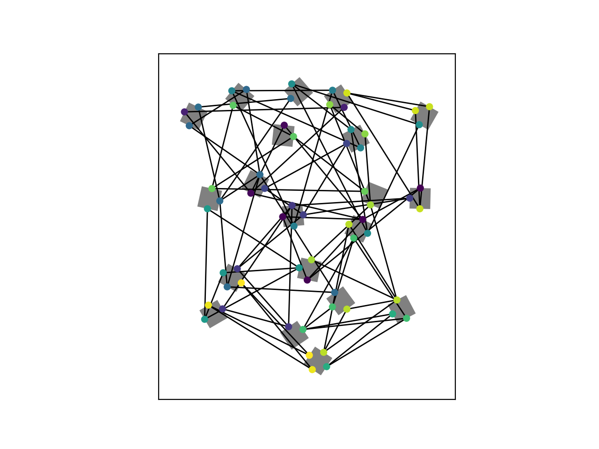
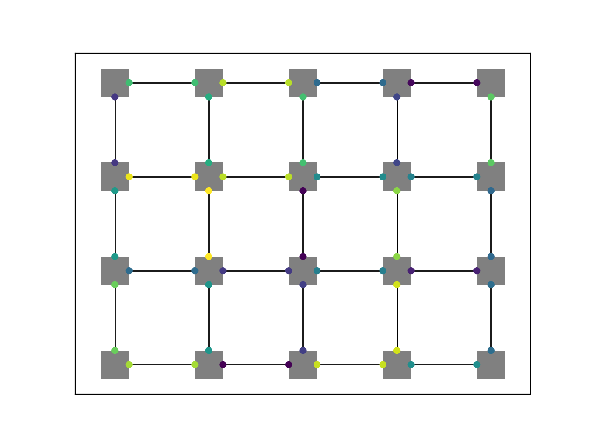

# Jigsaw Solver

The problem described in this repo is based on a problem, the YouTube channel StaffMadeHere mentioned in [his video](https://youtu.be/WsPHBD5NsS0) about building an automated jigsaw puzzle solver (both, logically and physically).

One task tackled in the video is the following: Given the tiles of a completely white jigsaw puzzle, determine the puzzle solution. Since all tiles are only white, matching puzzle tiles can be determined only by comparing the edge shapes of the tiles against each other. The solution, presented in the video, determines the four edges of each tile, maps the shape of the edges into a high dimensional vector space and matches equally shaped edges as join partners in the final puzzle solution. The issue arising here is that neighbored tiles in the solution not always share an exactly equal shape, due to production issues of the puzzle or uncertainties occuring during the digitalizing of the tile edges. Then it can happen that no join partner is found for specific tile edges or the wrong tiles are matched in the end.

A solution of this issue is presented in this repo: Instead of trying to match the edges locally ("these two edges are a good/perfect match"), a global satisfiability problem is considered taking all matching candidates into account and using the grid layout topology of the resulting matching graph to find the solution. Matching candidates can be defined in different ways, e.g. the K-nearest-neighbors of each tile edge in the edge shape vector space can be considered as matching candidates.
## Run code

1. Create environment
    ```bash
    python3 -m venv venv
    source ./venv/bin/activate
    pip install -U pip && pip install -r requirements.txt
    ```

2. Run code
    ```bash
    python main.py
    ```

## Finding a set of edge matching candidates

Before computing the actual puzzle solution using the Constraint Program (CP) defined in the next section we have to find a set of candidates of matching tile edges. Two tile edges should be considered as a matching candidate, if a specified similarity metric between these tile edges is fulfilled. It should be ensured that all matching edges of the final solution are in the set of candidates, because the final solution is a subset of these candidates. Thus, it may make sense to use a looser notion of similarity and starting with a bigger set of matching candidates.

For reasons of simplicity, the shape of each tile edge is defined as a value between 0 and 1. As a similarity metric we use the k nearest neighbors of each tile edge (no commutative property), resulting in at least k candidates for each tile edge. A commutative similarity metric could be considering two edges as similar, if the absolute difference of the shape values is smaller than a specifed threshold. In general an arbitrary similarity metric to determine matching candidates can be applied.

In the following, the set of matching candidates is visualized as the resulting graph.



## The Satisfiability Problem

Given a jigsaw puzzle with $N$ tiles, we can construct a graph $G$ with $4N$ vertices $V$, each one representing one of the four edges of a tile. The set of edges $E$ of the graph represents similarities between tile edges. Two vertices $u, v \in V$ are connected in $G$, if their associated tile edges fullfill an according similarity metric (e.g. KNNs or Distance in a similairty space).

In the solution of the jigsaw puzzle, exactly one edge incident to each vertex is selected, conecting the associated tile edge with exactly one other matching tile edge. The only exceptions are the boundary tiles, where only 2 (for corners) or 3 (for rest of boundary) vertices have matching partners. Thus we exclude the boundary tile edges from the vertex set in the following and consider only tile edges, which need a matching partner in the puzzle.

Finding the solution of the puzzle can be defined as a satisfiability problem as below. Under the assumption that the edges of the final puzzle solution are all in the set of candidate edges $E$, the problem has (at least, and hopefully exactly) one satisfying solution.

### Finding a perfect matching in $G$

There exist [several algorithms](https://en.wikipedia.org/wiki/Maximum_cardinality_matching) for finding a perfect matching in a graph in polynomial time. But since we have to embed further constraints to the matching later, we define a constrained perfect matching problem as a CP as follows:

$$
\begin{equation*}
\begin{array}{ll@{}ll}
\text{minimize}  & 1 &\\
\text{subject to}& \displaystyle\sum_{e=\\{u, v\\} \in E} &x_e = 1,  &\forall \\; v \in V\\
                 &                                                &x_{e} \in \{0,1\}, &\forall e \in E
\end{array}
\end{equation*}
$$

Here, variable $x_e \in \\{0, 1\\}$ is $1$, iff the edge $e = {u, v}$ is part of the puzzle solution, i.e. the tile edges associated with $u$ and $v$ are joined in the puzzle. The constraint ensures that each tile edge has exactely one join partner in the end.

### Ensuring grid layout of the connected puzzle tiles.

The above defined matching problem on its own is not guaranteed to yield a valid solution of the jigsaw puzzle. Just because two parts always fit together individually does not mean that all parts are arranged in a grid in the end. Thus we have to add another set of constraints, ensuring the grid layout of the graph.

The following example explains the idea: Consider three arbitrary tiles $T1, T2$ and $T3$ of the puzzle which are connected in the constructed graph of matching candidates as visualized in the schematic below: $T1$ is connected to $T2$ via the vertices $v_1$ and $v_3$. The vertex $v_2$ is the clockwise neighbor of $v_1$ on $T1$. $v_2$ connects $T1$ via an edge to $v_5$ on $T3$. Now we consider the counter-clockwise neighbor of $v_3$ on $T2$, here denoted as $v_4$ and the clockwise neighbor of $v_5$ on $T3$, namely $v_6$.

```
    +---------+           +---------+
    |         |           |         |
    |    T2   v4--------- v7   T4   |
    |         |           |         |
    +--- v3 --+           +--- v8 --+
         |                     |
         |                     |
         |                     |
    +--- v1 --+           +--- v6 --+
    |         |           |         |
    |    T1   v2----------v5   T3   |
    |         |           |         |
    +---------+           +---------+
```

The grid layout constraints can then defined as follows:
- Case 1: $v_4$ and $v_6$ have both edges to another common tile $T4$, denoted $\\{v_4, v_7\\}$ and $\\{v_6, v_8\\}$, such that $v_7$ is the clockwise neighbor of $v_8$ on $T_4$. This does not necessarily have to be unique, since there can be several such edges in $G$. In order to enforce the grid layout of the resulting matching graph the following constraint must be fulfilled: If $\\{v_1, v_3\\}$ and $\\{v_2, v_5\\}$ are both in the solution, then exactly one of these edge pairs from $T_2$ and $T_3$ to a common other tile must also be in the solution.
    The following constraint is added to the problem (the $\dots$ indicates that there can be other tiles than $T_4$ with the same relation to $T_2$ and $T_3$ in $G$):

$$
    x_{\\{v_1, v_2\\}} + x_{\\{v_2, v_5\\}} = 2 \implies ((x_{\\{v_4, v_7\\}}) + x_{\\{v_6, v_8\\}} = 2) \hspace{0.4em} \lor \hspace{0.4em} ...)
$$

- Case 1: $v_4$ and $v_6$ have no edges to at least one common other tile $T4$ as described in case 1. From this it follows that the edges $\\{v_1, v_3\\}$ and $\\{v_2, v_5\\}$ cannot be together in a valid jigsaw puzzle solution, because this would violate the grid layout constraint. The resulting constraint can be defined as:

$$
    x_{\\{v_1, v_2\\}} + x_{\\{v_2, v_5\\}} \leq 1
$$

## Solution


